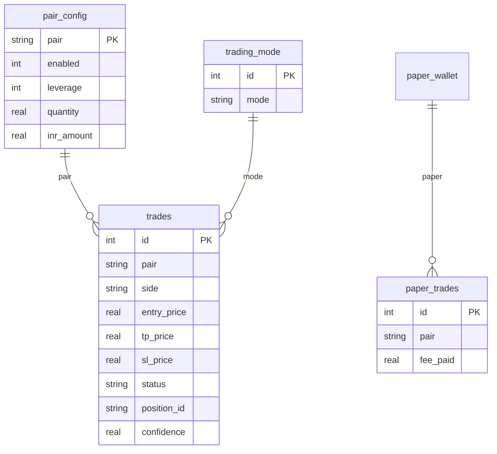
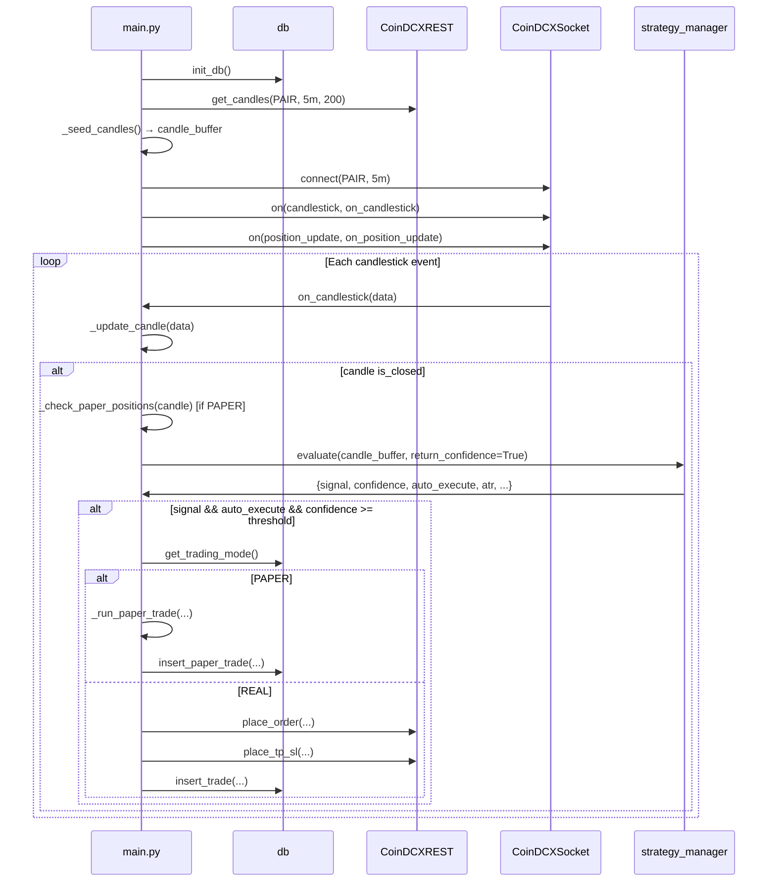
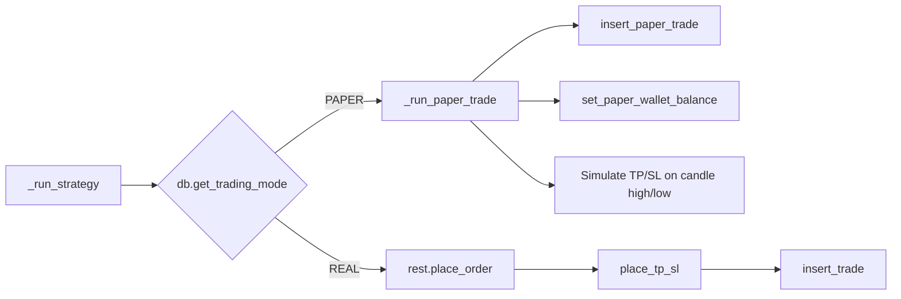
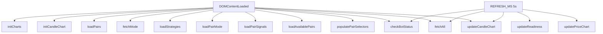

# ALGO DESK — Crypto Trading Bot Architecture Documentation

**Purpose**: This document describes the project's code-flow, design architecture, database schema, and functionality. Use it to onboard AI agents or developers for modification and enhancement.

---

## 1. Executive Summary

### Project Purpose

The trading bot automates crypto futures trading on **CoinDCX** via its REST and WebSocket APIs. When the selected strategy matches trading conditions at **90% confidence** (configurable), it executes trades and sets **Take Profit (TP)** and **Stop Loss (SL)** based on the strategy.

### Key Features

| Feature | Description |
|---------|-------------|
| **Paper Mode** | Simulates trades internally; no real orders. Tracks entry/exit, TP/SL hits, P&L to validate strategy before going live. |
| **Real Mode** | Executes live trades with real money using CoinDCX APIs. |
| **Strategy-Based Execution** | Uses configurable strategies (e.g. EMA, MACD, RSI, volume). Executes only when confidence ≥ threshold (default 75%, UI shows 90% threshold). |
| **TP/SL** | Calculated per strategy (percentage or ATR-based) and placed via API or simulated in paper mode. |
| **Web Dashboard** | Visualizes open positions, live P&L, trade history; enables strategy switching, bot start/stop, pair management, signal readiness. |

### High-Level Flow

```
Seed candles → WebSocket candlesticks → Strategy evaluate → (if signal + auto_execute)
  → PAPER: insert paper trade
  → REAL:  place_order + place_tp_sl + insert trade
```

---

## 2. Project Structure

```
trading-bot-project/
├── bot/
│   ├── main.py              # Single-pair bot entry (strategy_manager)
│   ├── main_multi_pair.py   # Multi-pair bot (uses strategy.py)
│   ├── bot_manager.py       # Spawns one main.py per enabled pair
│   ├── coindcx.py           # CoinDCX REST & WebSocket wrapper
│   ├── db.py                # SQLite persistence
│   ├── strategy.py          # Standalone strategy (pair_signals, main_multi_pair)
│   ├── strategy_base.py     # Abstract base for strategy plugins
│   ├── strategy_manager.py  # Strategy plugin loader
│   └── strategies/
│       ├── enhanced_v2.py   # EMA + MACD + RSI + ATR + volume
│       └── simple_ema.py    # Simple EMA + RSI
├── server/
│   └── app.py               # Flask API
├── dashboard/
│   ├── index.html
│   ├── css/
│   └── js/
│       ├── app.js           # Config, globals
│       ├── init.js          # Boot sequence
│       ├── data.js          # API fetches
│       ├── ui.js            # Render stats, trades
│       ├── charts.js        # Chart.js
│       ├── candlestick.js   # Lightweight-charts
│       ├── pair-mode.js     # Pair signals, mode
│       └── pair-manager.js  # Pair config, scanner
├── bot.service
├── server.service
├── nginx.conf
└── .github/workflows/deploy.yml
```

---

## 3. Architecture Diagram

```mermaid
flowchart TB
    subgraph UI["Dashboard"]
        init[init.js]
        fetch[data.js: fetchAll]
    end

    subgraph Nginx
        Nginx80[:80]
    end

    subgraph Flask["Flask (app.py)"]
        Routes[/api/*]
        db[(SQLite via db.py)]
    end

    subgraph Bot["Bot Process(es)"]
        main[main.py]
        ws[CoinDCX WebSocket]
        strategy[strategy_manager]
        rest[CoinDCXREST]
    end

    Nginx80 --> Dashboard[/dashboard/*]
    Nginx80 --> API[/api/* → :5000]

    init --> loadPairs
    init --> fetchMode
    init --> loadPairMode
    init --> loadPairSignals
    init --> loadAvailablePairs
    init --> fetchAll

    fetch --> Routes
    Routes --> db

    main --> ws
    ws -->|candlestick| strategy
    strategy -->|signal + auto_execute| rest
    rest --> CoinDCX[CoinDCX API]
    main --> db
```

---

## 4. Database Architecture

**Path**: `bot/db.py` → `DB_PATH = "/home/ubuntu/trading-bot/data/bot.db"`

### Tables

| Table | Purpose |
|-------|---------|
| `trades` | Real trades (open/closed). Columns: pair, side, entry_price, exit_price, quantity, leverage, tp_price, sl_price, pnl, status, order_id, position_id, strategy_name, confidence, atr, position_size, trailing_stop |
| `paper_trades` | Paper trades (same structure + fee_paid) |
| `bot_log` | Log events (level, message) |
| `equity_snapshots` | Real wallet balance over time |
| `paper_equity_snapshots` | Paper balance over time |
| `pair_config` | Per-pair: pair, enabled, leverage, quantity, inr_amount |
| `trading_mode` | Singleton (id=1): mode = REAL \| PAPER |
| `paper_wallet` | Singleton (id=1): balance |
| `bot_config` | Singleton: pair_mode (SINGLE/MULTI), selected_pair |

### ER Diagram



---

## 5. Code Flow Diagrams

### 5.1 Bot Flow (main.py)



### 5.2 Paper vs Real Mode Branching



### 5.3 Paper Position Close (TP/SL Simulation)

On each **closed candle**, `_check_paper_positions()` compares candle high/low with TP/SL. If TP or SL is hit, it closes the paper trade and updates the paper wallet balance.

### 5.4 Live Positions (Real Mode)

- **Bot-opened**: Stored in `trades`; closed via WS `position_update` → `on_position_update()` → `db.close_trade()`.
- **UI / Platform-opened**: Fetched via `/api/live/positions` from CoinDCX List Positions API with `margin_currency_short_name: ["INR"]`.

### 5.5 UI Boot & Refresh



---

## 6. Module Reference

### bot/

| File | Responsibility |
|------|----------------|
| `main.py` | Single-pair bot: seed candles, WS, strategy_manager, order placement, DB writes |
| `main_multi_pair.py` | Multi-pair bot using strategy.py (legacy path) |
| `bot_manager.py` | Spawns `main.py <PAIR>` per enabled pair; monitors and restarts |
| `coindcx.py` | `CoinDCXREST`, `CoinDCXSocket` — REST + WebSocket for CoinDCX |
| `db.py` | SQLite: init_db, get_trading_mode, insert_trade, get_open_trades, pair_config, etc. |
| `strategy.py` | Standalone: evaluate, calculate_tp_sl, calculate_signal_strength (used by pair_signals, main_multi_pair) |
| `strategy_base.py` | `TradingStrategy` abstract base class |
| `strategy_manager.py` | Loads strategies from `strategies/`, delegates evaluate/calculate_tp_sl |
| `strategies/enhanced_v2.py` | EMA, MACD, RSI, ATR, volume, dynamic sizing, trailing stop |
| `strategies/simple_ema.py` | Basic EMA crossover + RSI |

### server/

| File | Responsibility |
|------|----------------|
| `app.py` | Flask app: REST API, CORS, all `/api/*` routes |

### dashboard/js/

| File | Responsibility |
|------|----------------|
| `app.js` | API base URL, REFRESH_MS, global state, showToast |
| `init.js` | Boot: initCharts, loadPairs, fetchMode, loadPairMode, loadPairSignals, loadAvailablePairs, fetchAll, setInterval |
| `data.js` | fetchMode, toggleMode, fetchAll, loadPairs, fetchOpenTrades, loadPairConfigs |
| `ui.js` | renderMode, renderStats, renderTrades, renderPaperTrades, renderLogs, renderFavorites |
| `charts.js` | Chart.js: equity, PnL, pair PnL |
| `candlestick.js` | Lightweight-charts candlestick, pair selector |
| `pair-mode.js` | loadPairMode, loadPairSignals, renderPairList, setPairMode |
| `pair-manager.js` | loadAvailablePairs, renderPairManager, togglePairEnabled, scanVisibleSignals, pagination |

---

## 7. API Reference

### Status & Control

| Endpoint | Method | Purpose |
|----------|--------|---------|
| `/api/status` | GET | Balance, paper_balance, mode, open_trades count |
| `/api/bot/status` | GET | `{running: bool}` |
| `/api/bot/start` | POST | systemctl start bot |
| `/api/bot/stop` | POST | systemctl stop bot |

### Mode & Config

| Endpoint | Method | Purpose |
|----------|--------|---------|
| `/api/mode` | GET/POST | Get or set REAL/PAPER |
| `/api/strategies` | GET/POST | List strategies, set active |
| `/api/pair_mode` | GET/POST | pair_mode, selected_pair |

### Trades & Positions

| Endpoint | Method | Purpose |
|----------|--------|---------|
| `/api/positions` | GET | Open real trades (DB) |
| `/api/trades` | GET | Recent real trades |
| `/api/trades/open` | GET | Open real trades (detailed) |
| `/api/paper/trades` | GET | Paper trades |
| `/api/paper/trades/open` | GET | Open paper trades |
| `/api/live/positions` | GET | Open positions from CoinDCX (INR-margined) |

### Stats & Equity

| Endpoint | Method | Purpose |
|----------|--------|---------|
| `/api/stats` | GET | Real trade stats |
| `/api/paper/stats` | GET | Paper trade stats |
| `/api/equity` | GET | Real equity history |
| `/api/paper/equity` | GET | Paper equity history |

### Pairs & Signals

| Endpoint | Method | Purpose |
|----------|--------|---------|
| `/api/pairs/available` | GET | CoinDCX active instruments |
| `/api/pairs/config` | GET | All pair configs |
| `/api/pairs/config/update` | POST | Update one pair |
| `/api/pairs/config/bulk` | POST | Bulk update |
| `/api/pairs/config/disable_all` | POST | Disable all |
| `/api/pair_signals` | GET | Signal strength for enabled pairs (top 10) |
| `/api/signal/readiness` | GET | Readiness per pair (`?pairs=B-BTC_USDT,B-ETH_USDT`) |
| `/api/candles` | GET | OHLCV (pair, interval, limit) |

### Paper & Debug

| Endpoint | Method | Purpose |
|----------|--------|---------|
| `/api/paper/balance` | GET | Paper wallet balance |
| `/api/paper/reset` | POST | Reset paper to real balance |
| `/api/logs` | GET | Recent bot logs |
| `/api/debug/wallet` | GET | Raw wallet/positions |
| `/api/debug/positions` | GET | Raw positions |

---

## 8. Strategy System

### strategy_manager (`bot/strategy_manager.py`)

- Loads classes from `strategies/*.py` that inherit `TradingStrategy`
- Methods: `get_available_strategies()`, `set_active_strategy()`, `get_active_strategy()`, `evaluate()`, `calculate_tp_sl()`
- Used by: `main.py`, `/api/strategies`

### strategy_base (`bot/strategy_base.py`)

- Abstract: `get_name()`, `get_description()`, `evaluate()`, `calculate_tp_sl()`
- `get_config()`, `update_config()`, `validate_config()`

### strategy.py (standalone)

- Used by: `/api/pair_signals`, `main_multi_pair`
- Functions: `evaluate()`, `calculate_tp_sl()`, `calculate_signal_strength()`
- Mirrors logic of `enhanced_v2`

### Strategies

- **enhanced_v2**: EMA, MACD, RSI, ATR, volume, dynamic sizing, trailing stop
- **simple_ema**: EMA crossover + RSI filter

---

## 9. UI Functionality Summary

| Feature | Implementation |
|---------|----------------|
| **Paper/Real switch** | `toggleMode()` → POST `/api/mode` |
| **Bot Start/Stop** | POST `/api/bot/start` or `/api/bot/stop` |
| **Strategy change** | Dropdown → POST `/api/strategies` |
| **Open positions** | REAL: `/api/live/positions`; PAPER: `/api/paper/trades/open` |
| **Pair management** | Pair Manager: enable/disable, leverage, INR amount; pagination; Scan Signals for top 10 |
| **Signal readiness** | `/api/signal/readiness?pairs=...` → progress bar per pair |

---

## 10. Environment & Deployment

### Env Vars

- `COINDCX_API_KEY`
- `COINDCX_API_SECRET`

### Hardcoded Paths (Server)

| Path | File |
|------|------|
| `/home/ubuntu/trading-bot/data/bot.db` | `db.py` |
| `/home/ubuntu/trading-bot/.env` | `main.py`, `app.py`, etc. |
| `/home/ubuntu/trading-bot/data/bot.log` | `main.py` |
| `/home/ubuntu/trading-bot/bot` | `app.py` sys.path |

### systemd

- `bot.service`: runs `bot_manager.py`
- `server.service`: runs Flask on port 5000

### Nginx

- Root: dashboard
- `/api/` → proxy to `127.0.0.1:5000`

### GitHub Actions

- Push to `main` → SSH deploy, pull, restart services

---

## 11. Extension Points

| Task | How |
|------|-----|
| Add strategy | Create `strategies/<name>.py` with class extending `TradingStrategy`; auto-loaded |
| Change TP/SL | Override `calculate_tp_sl()` in strategy |
| Add pair | Enable in Pair Manager; config in `pair_config` |
| New API route | Add in `server/app.py` |

---

*Last updated: 2025-02*
